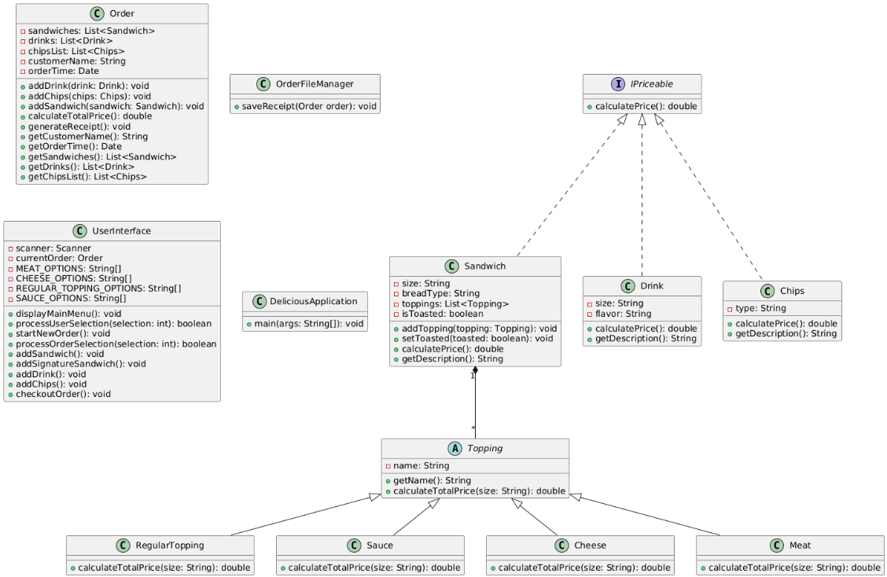
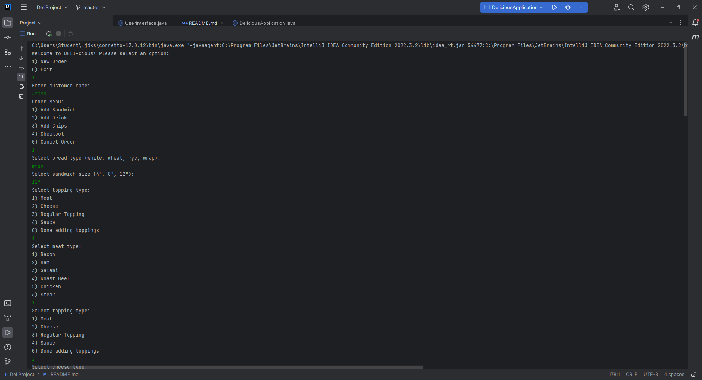
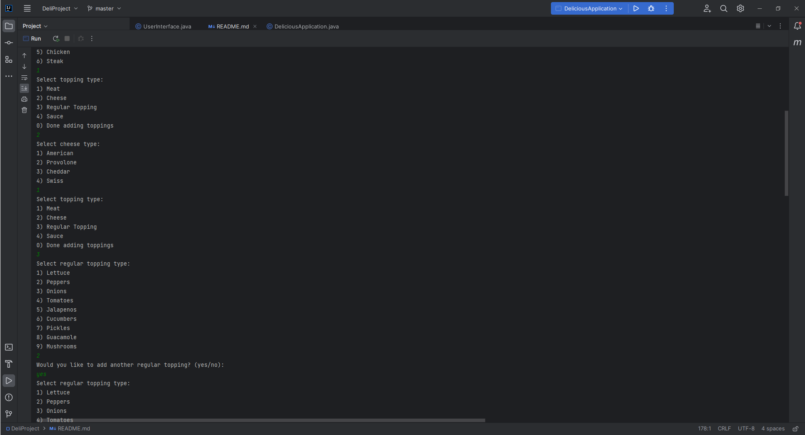
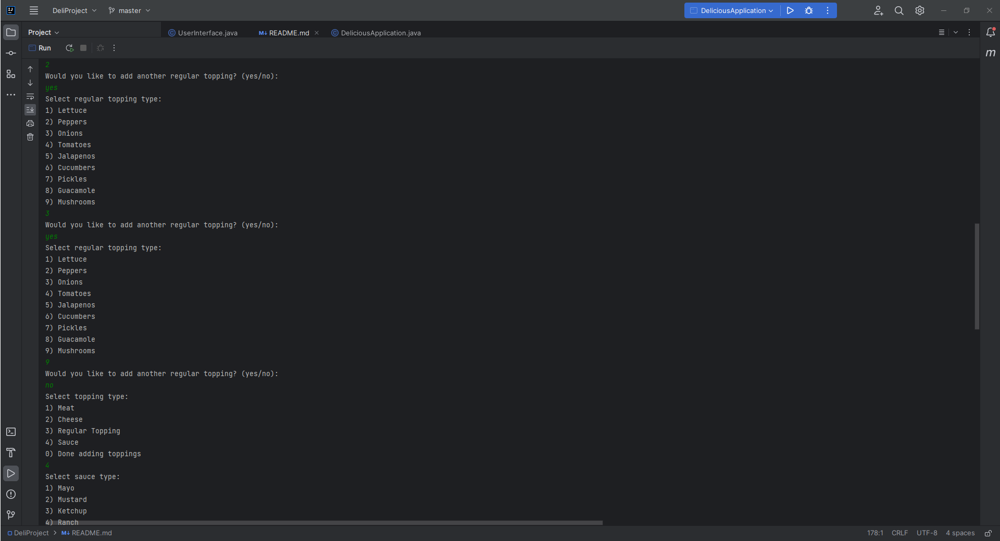
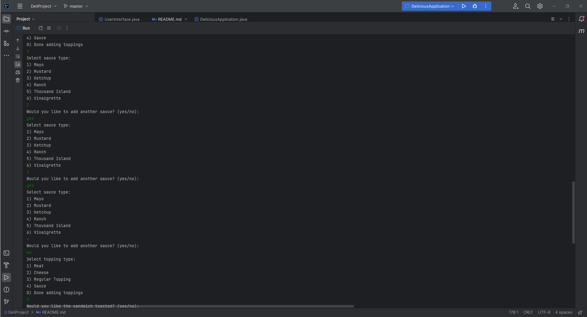
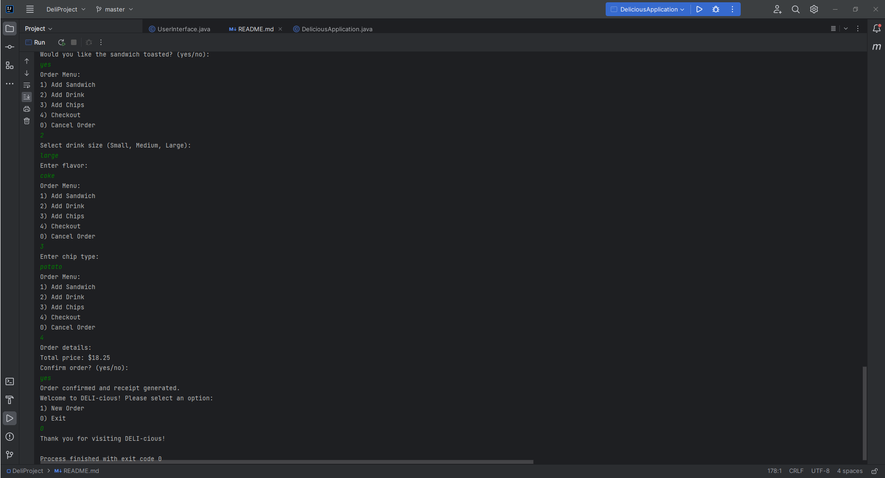

# DELI-cious Order System

## Description of the Project

This project is a Java console application that serves as a point of sales system for "DELI-cious", a custom sandwich shop. The application allows users to create, customize, and place sandwich orders. Users can choose bread type, sandwich size, toppings, sauces, and also add drinks and chips to their orders. The purpose of the project is to automate the order-taking process, reducing reliance on paper-based methods and providing a better customer experience.

The intended users are the shop staff and customers who want to streamline the ordering process. The main functionality includes customizing sandwiches, adding drinks and chips, calculating the total price, and generating receipts for the orders. The application aims to solve the problem of managing orders efficiently, reducing human error, and speeding up the order process.

## User Stories

- As a customer, I want to quickly select from a list of signature sandwiches so that I can save time while ordering.
- As a customer, I want to have the option to toast my sandwich so that I can enjoy a warm and crispy meal.
- As a staff member, I want the system to generate a receipt automatically so that I can keep records of all transactions.
- As a customer, I want to be able to order a customized sandwich so that I can enjoy a meal according to my taste.
- As a customer, I want to add drinks and chips to my order so that I can have a complete meal.
- As a customer, I want to receive a summary of my order, including the total price, so that I can verify the details before confirming.
- As a staff member, I want to automate the order process so that I can reduce errors and save time.

## Setup

Instructions on how to set up and run the project using IntelliJ IDEA.

### Prerequisites

- IntelliJ IDEA: Ensure you have IntelliJ IDEA installed, which you can download from [here](https://www.jetbrains.com/idea/download/).
- Java SDK: Make sure Java SDK is installed and configured in IntelliJ.

### Running the Application in IntelliJ

Follow these steps to get your application running within IntelliJ IDEA:

1. Open IntelliJ IDEA.
2. Select "Open" and navigate to the directory where you cloned or downloaded the project.
3. After the project opens, wait for IntelliJ to index the files and set up the project.
4. Find the `DeliciousApplication` class, which contains the `public static void main(String[] args)` method.
5. Right-click on the file and select 'Run `DeliciousApplication.main()`' to start the application.

## Technologies Used

- Java: Version 17 (Amazon Corretto 17.0.13)
- PlantUML: Used to create class diagrams for the project.

## Demo

## Future Work

- Add support for online orders to expand the customer base.
- Introduce a database to manage customer data and orders persistently.
- Enhance the user interface to include graphical elements.

## Resources

- [Java Programming Tutorial](https://www.w3schools.com/java/)
- [Effective Java](https://www.oreilly.com/library/view/effective-java-3rd/9780134686097/)

## Team Members

- **Mehmet Uzun** - Developer 

## Thanks

- Thank you to Raymond Maroun for continuous support and guidance.
- A special thanks to all teammates for their dedication and teamwork.
